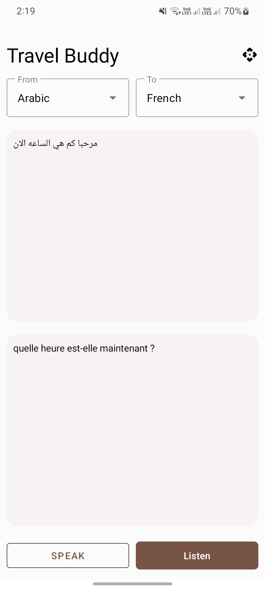
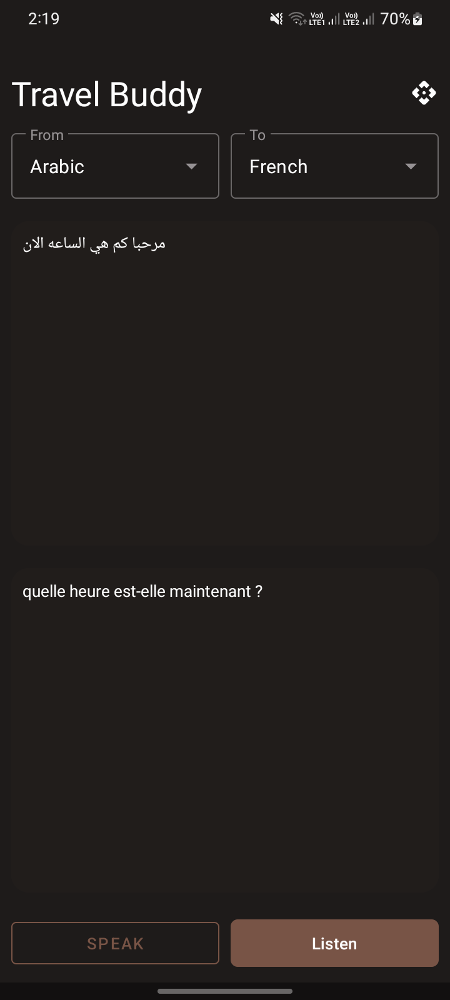

# Travel Buddy

A Native Android application leveraging AI, Text-to-Speech (TTS), and Speech-to-Text (STT) technologies to translate spoken text into multiple languages.

# Preview

Light Mode             |  Dark Mode
:-------------------------:|:-------------------------:
  |  

## Technolgy used:

- Kotlin
- Kotlin Coroutines
- Kotlin Flow
- Koin
- Ktor
- MVVM (Model-View-ViewModel)
- SDP & SSP

## Find a bug?

if you found an issue or would like to submit an improvement to this project, please submit an issue using the issue tab above. If you would like to submit a PR with a fix, reference the issue you created!

## License

The patches published as part of the Travel Buddy project are released under [GNU GPL v3](./LICENSE).
